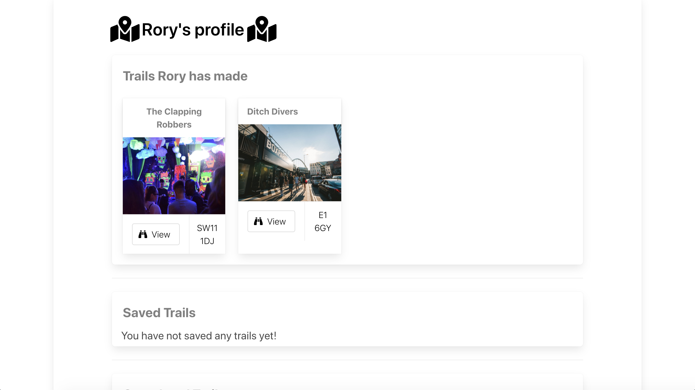

# sei-group-project

# Software Engineering Immersive: Project 3
This was the third project built whilst studying the Software Engineering Immersive course at General Assembly.

This application was built in 1 week.

## Team members
This application was built by me and my team
+ [Astara Cambata](https://github.com/astara303)
+ [Ellen Wadell](https://github.com/Ellenstarbuck)
+ [Latch Jack](https://github.com/latchjack)

# GeocachR

## Brief
The projects necessary requirements were..
* Work in a team, using git to code collaboratively.
* Build a full-stack application by making your own backend and your own front-end
* Use an Express API to serve your data from a Mongo database
* Consume your API with a separate front-end built with React
* Be a complete product which most likely means multiple relationships and CRUD functionality for at least a couple of models
* Implement thoughtful user stories/wireframes that are significant enough to help you know which features are core MVP and which you can cut
* Have a visually impressive design to kick your portfolio up a notch and have something to wow future clients & employers. ALLOW time for this.
* Be deployed online so it's publicly accessible.
* Have automated tests for _at least_ one RESTful resource on the back-end. Improve your employability by demonstrating a good understanding of testing principals.


## Tech Stack

+ HTML5
+ SCSS & Bulma
+ Javascript
  * ECMAScript6
  * React.js
  * Node.js
  * Express.js
  * axios
+ NoSQL
  * MongoDB
* API's
  * Uber's React Mapbox-GL API
  * OpenWeather API
+ Testing
  * Manual: Insomnia
  * Automated: Mocha & Chai
+ Git & GitHub
+ Additional Packages:
  * Mongoose
  * Bcrypt
  * JsonWebToken
  * body-parser
  * React Select
  * Font Awesome
  * Affinity Designer

## Release History
1.0 - This project will not be updated so as to serve as a benchmark for how much I have improved since the date (14/02/20) this was submitted and deployed.

## Deployment
This web app is deployed on Heroku and it can be found here - [GeocachR](https://getgeocachr.herokuapp.com/)

## Getting Started
Use the clone button to download the source code. In the terminal enter the following commands...
```
<!-- To install all the packages listed in the package.json: -->
$ yarn

<!-- Run the app in your localhost: -->
$ yarn start

<!-- Check the console for any issues and if there are check the package.json for any dependancies missing  -->
```

## User Experience

### Homepage
When the user arrives at the website the first thing will see is our homepage with the company logo.
We have the navbar at the top of the screen with clickable links for the user to explore the site and its functions.


### Login & Register
When a user visits our page they are able to browse through our index of trails and even look at what the clues there are to solve each trail. However they are unable to save or complete the trails and lose on out on the site's functionality without becoming a user.

User's are able to register to the site via the registration page. The register functional also validates the user's credentials to make sure they are inputting the correct type of information for their sign up process. The email box checks to see if an email address has been entered into the box and the password and password confirmation will only work if the password is type identically both times. If the password is incorrect the user will be prompted to enter it again.


Once registered a user can log in to the site which will allow them to create, edit and delete a trail. They can also save any trails that they would like to take part in, these will then be displayed on the user's profile page.


### Index
The index page with a list of all the trails available to the users. Each of the trail's cards also have a little information for the user such as the postcode that the trail is located at so the user can find one close by to them.


### Profile
Once a user has signed up and logged in, a `Profile` button is created in the navbar which is where the users can see trails they have completed, saved or created.


A picture of the user's profile once they have saved some trail and created one of their own.


### Creating/Editing/Deleting a trail
A user is able to create and edit trails of their own once they've signed up. However they are unable to edit or delete trails that are not created by them as we have built in authentication to ensure they couldn't delete another user's trails.

To create a trail a user needs to enter the following information
1. Name of the Trail
2. Postcode the trail is located at
3. Some clues...
    * Clue One
    * Clue Two
    * Clue Three
4. A picture of the location/start point
5. A marker on the map of the location.


If the user clicks on a trail they have created, the Edit and Delete button appear.


If they click on the Edit button they are brought over to Trail Edit page and they are able to change any of the inputted data.


## Planning
When we started the project we decided very quickly that we were going to work on a project that would be about getting people outdoors and connecting them. We thought using coordinates or geolocation would be pretty interesting. We discussed spies using Deaddrops and geo-caching. 

Shortly after this we decided we would build a geo-caching website that had elements of treasure hunting (à la Nicholas Cage in National Treasure). We knew we would have to use a mapping API so that user's could use a map to display where they would like partakers to start the treasure-hunt from.

### Backend
We first got to work on building the backend of the project, for which we used MongoDB. This was essential as we needed to store a lot of information about all of the trails and our users.
We designed our models so we knew how our models would connect and then started building.

This diagram displays the relationships between the models within our database.


This diagram's purpose was to outline which pieces of data were stored in which model. The lines from the models that have a single horizontal (or vertical in some cases) are displaying that the model with being given only one segment of data from the model it is connected to. The lines with the fork endings are indicating that these models are receiving multiple segments of data from the other connecting model.

In the case of our application a registered user can leave comments and likes on each trail (a one-to-many relationship). Whereas a trail, comment and a like can only belong to/be created by one user (a many-to-one relationship).

### Frontend
The frontend of our application was built using React.js. We pulled in the data from our APIs and backend using axios. The frontend was built in many small React components that we built separately and then pieced together.

Our components were separated into three separate categories. We had an authentication folder which containted the registration and the login components. We had another folder for all of the trail components, for components such as the forms for creating a trail or the trail completion form. It is also where we store the trail card and trail show component.
The last folder was for the common components. This was where we stored components such as our navbar, footer and the map components.

### My contributions
The main focus for me in the projest was to work on building the front-end. From pulling through the database and pulling it through and linking the relevant information to the right pages. This included me setting up the navigation bar also.
This part of the project was key in setting a good framework in which my team could add their parts in later.


I spent some time plannning and mapping the components I would need to set up a good framework. I planned the following components for the project:
1. Trail Index- Shows all trails by pulling database from back-end through
2. Trail Card - Held and Formatted the information the trail Index.
3. Trail Show - Showed a specific trail when one was selected from the main directory (trail index) 
4. Navigation Menu & App.js linking - Allowed the user to move around the website and allowed myself and my team to test the links and pages whilst building the app.
5. Search Bar - A search bar on the Index page which allowed users to focus on a trail by postcode.
6. Weather Widget- Making a live Weather widget in the footer for users to know a good time to go geo-caching (updated every 5 minutes)


_Trail Index and Search Function_
```js
import React from 'react'
import axios from 'axios'

import TrailCard from './TrailCard'
import Search from './Search'

class TrailIndex extends React.Component {
  state = {
    trails: [],
    searchTerm: ''
  }

  async componentDidMount() {
    try {
      const res = await axios.get('/api/trails')
      this.setState({ trails: res.data, searchData: res.data })
    } catch (err) {
      console.log(err)
    }
  }

  basicSearchFunction = (e) => {
    this.setState({ searchTerm: e.target.value })

  }

  filterTrails = () => {
    const searchTerm = new RegExp(this.state.searchTerm, 'i')
    return this.state.trails.filter(trail => searchTerm.test(trail.directions))
  }

  render() {
    return (
      <section className="trailIndex">
        <div className="trailContainer">
          <div className="box">
            <div className="Search">
              
              <Search
                basicSearchFunction={this.basicSearchFunction}
                {...this.state}
              />
            </div>
          </div>
          <div className="columns is-mobile is-multiline">
            {this.filterTrails().map(trail => (
              <TrailCard key={trail.name} {...trail} />
            ))}
          </div>
        </div>
      </section>
    )
  }
}

export default TrailIndex

```


_Trail Card_
```js
import React from 'react'
import { Link } from 'react-router-dom'
import { FontAwesomeIcon } from '@fortawesome/react-fontawesome'
import { faBinoculars } from '@fortawesome/free-solid-svg-icons'

const TrailCard = ({ name, image, directions, _id }) => (
  <div key={_id} className="column is-one-quarter-desktop is-one-third-tablet is-half-mobile">
    <Link to={`/trails/${_id}`}>
      <div className="card">
        <div className="card-header">
          <h4 className="card-header-title">{name}</h4>
        </div>
        <div className="card-image">
          <figure className="image is-4by3">
            
          </figure>
        </div>
        <footer className="card-footer">
          <p className="card-footer-item">
            <span>
              <button className="button">
                <span className="icon is-small">
                  <FontAwesomeIcon icon={faBinoculars} />
                </span>
                <span className="has-text-weight-light">View</span>
              </button>
            </span>
          </p>
          <p className="card-footer-item has-text-centered">
            <span className="has-text-weight-light">
              {directions}
            </span>
          </p>
        </footer>
      </div>
    </Link>
  </div >
)

export default TrailCard
```
_Tail Show- (My role in this code was "componentDidMount and collaborated with team on HTML format)_
```js
import React from 'react'
import axios from 'axios'
import { Link } from 'react-router-dom'
import Collapsible from 'react-collapsible'
import auth from '../../lib/auth'
import { FontAwesomeIcon } from '@fortawesome/react-fontawesome'
import { faHeart, faHeartBroken } from '@fortawesome/free-solid-svg-icons'
import IdMap from '../common/IdMap'
import Auth from '../../lib/auth'

class TrailShow extends React.Component {
  state = {

    trail: null,
    save: false,
    text: '',
    image: null,
    completeOwner: ''

  }

  async componentDidMount() {
    const trailId = this.props.match.params.id
    try {
      const res = await axios.get(`/api/trails/${trailId}`)
      this.setState({ trail: res.data })
    } catch (err) {
      this.props.history.push('/notfound')
    }
  }

  handleDelete = async () => {
    const trailId = this.props.match.params.id
    try {
      await axios.delete(`/api/trails/${trailId}`, {
        headers: {
          Authorization: `Bearer ${auth.getToken()}`
        }
      })
      this.props.history.push('/trails')
    } catch (err) {
      this.props.history.push('/notfound')
    }
  }

  isOwner = () => {
    return auth.getPayLoad().sub === this.state.trail.user._id
  }

  handleSave = async () => {
    const trailId = this.props.match.params.id
    try {
      await axios.get(`/api/trails/${trailId}/like`, {
        headers: { Authorization: `Bearer ${auth.getToken()}` }
      })
    } catch (err) {
      this.props.history.push('/notfound')
    }
  }

  handleLikeDelete = async () => {
    const trailId = this.props.match.params.id
    try {
      await axios.delete(`/api/trails/${trailId}/like`, {
        headers: {
          Authorization: `Bearer ${auth.getToken()}`
        }
      })
      this.props.history.push('/trails')
    } catch (err) {
      this.props.history.push('/notfound')
    }
  }

  handleChange = e => {
    const data = { ...this.state.data, [e.target.name]: e.target.value }
    this.setState({ data })
  }

  handleSubmit = async () => {
    //e.preventDefault()
    const trailId = this.props.match.params.id
    try {
      await axios.post(`/api/trails/${trailId}/complete`, this.state.data,
        {
          headers: { Authorization: `Bearer ${auth.getToken()}` }
        })
      this.setState({ image: null, text: '' })
    } catch (err) {
      this.props.history.push('/notfound')
    }
  }

  handleUpload = async ({ target: { files } }) => {
    const data = new FormData
    data.append('file', files[0])
    data.append('upload_preset', 'rksde5wr')
    const res = await axios.post(' https://api.cloudinary.com/v1_1/dbpx50jcj/image/upload', data)
    this.setState({ image: res.data.url }, () => {
      this.handleChange({ target: { name: 'image', value: res.data.url } })
    })
  }

  isCompleteOwner = completion => {
    return completion.user._id === Auth.getUser()
  }

  handleCompleteDelete = async (completetion) => {
    const trailId = this.props.match.params.id
    const completeId = completetion._id
    try {
      await axios.delete(`/api/trails/${trailId}/complete/${completeId}`,
        {
          headers: { Authorization: `Bearer ${auth.getToken()}` }
        })
      this.props.history.push('/profile')
    } catch (err) {
      this.props.history.push('/notfound')
    }
  }

  render() {
    const { trail } = this.state
    if (!trail) return null
    const labelClass = this.props.labelClassName ? this.props.labelClassName : 'default_class'
    const { image } = this.state
    return (
      <section className="section">
        <div className="SHOWPAGE">
          <h2 className='trailTitle is-size-1'>{trail.name}</h2>
          {trail.weatherFactor &&
          <div>
            <i className="fas fa-cloud-sun-rain"></i>
            &nbsp;You&apos;ll need good weather for this trail!
          </div>
          }
          {!trail.weatherFactor &&
          <div>
            <i className="fas fa-building"></i>
            &nbsp;You can do this trail in any weather!
          </div>   
          }
          <br />
          <br />
          <button onClick={this.handleSave} className="button is-danger">
            <span className="icon is-small">
              <FontAwesomeIcon icon={faHeart} />
            </span>
            <span>Save</span>
          </button>
          <button onClick={this.handleLikeDelete} className="button">
            <span className="icon is-small">
              <FontAwesomeIcon icon={faHeartBroken} />
            </span>
            <span>Remove</span>
          </button>
          
          <hr />
          <div className="columns">
            <div className="column is-6">
          
              <div className="Mapbox">
                <br />

                <IdMap
                  data={{
                    latitude: trail.latitude,
                    longitude: trail.longitude
                  }}
                />
              </div>
              <br />
              
              <h1 className='commentTitle'>Comments on this Geocache!</h1>
              <br />
              <article className="media">
                {this.state.trail.completion.map(complete => {
                  return <div key={complete._id}>
                    <div className='box'>
                      <p>{complete.user.username}</p>
                      <div className="media-left">
                        <figure className="image is-64x64">
                          
                        </figure>
                      </div>
                      <div className='media-content'>
                        <div className='content'>
                          <p>{complete.text}</p>
                        </div>
                      </div>
                    </div>
                    {this.isCompleteOwner(complete) && <button onClick={() => this.handleCompleteDelete(complete)} className="button is-danger">Delete my comment</button>}
                  </div>
                })
                }
              </article>
              <br />
            </div>   
            <div className="box">
              <h3 className="clueTitle is-size-3">Trail Clues</h3>
              <hr />
              <Collapsible trigger='Clue One +' className="dropDown">
                <p className="showClue">{trail.clueOne}</p>
              </Collapsible>
              <hr />
              <Collapsible trigger='Clue Two +' className="dropDown">
                <p className="showClue">{trail.clueTwo}</p>
              </Collapsible>
              <hr />
              <Collapsible trigger='Clue Three +' className="dropDown">
                <p className="showClue">{trail.clueThree}</p>
              </Collapsible>
              <hr />
              <h4>{trail.weatherFactor}</h4>
              <Collapsible trigger='Have You Completed This GeoCache?' className="dropDown">
                <div className="card-content">
                  <form onSubmit={this.handleSubmit}>
                    <h2 className="title">Geocache Logbook</h2>
                    <div className="field">
                      <label className="label">How was your experience?</label>
                      <div className="control">
                        <input
                          className="input"
                          name="text"
                          required
                          placeholder="Text"
                          onChange={this.handleChange}
                        />
                      </div>
                    </div>
                    <hr />
                    {image ?
                      <div>
                        
                      </div>
                      :
                        <>
                          <h4>Please upload a photo</h4>
                          <br />
                          <label className={labelClass}>{this.props.labelText}</label>
                          <input
                            className={this.props.inputClassName}
                            type="file"
                            onChange={this.handleUpload}
                          />
                        </>
                    }
                    <hr />
                    <button type="submit" className="button is-fullwidth is-warning">Submit</button>
                  </form>
                </div>
              </Collapsible>
              <hr />

              {this.isOwner() &&
                <div>
                  <Link to={`/trails/${trail._id}/edit`} className="button is-warning">Edit Trail</Link>
                  <button onClick={this.handleDelete} className="button is-danger">Delete Trail</button>
                </div>
              }

            </div>
          </div>
        </div>
      </section>
    )
  }
}

export default TrailShow

```
_Navigation Menu- (The authetication of the links were added as a part of another team mates remit)_
```js
import React from 'react'
import { Link, withRouter } from 'react-router-dom'
import auth from '../../lib/auth'
import GeoSvg from './../../assets/geo_planet.svg'


class Navbar extends React.Component {

  state = { navbarOpen: false }

  toggleNavbar = () => {
    this.setState({ navbarOpen: !this.state.navbarOpen })
  }

  handleLogout = () => {
    auth.logout()
    this.props.history.push('/')
  }

  componentDidUpdate(prevProps) {
    if (this.props.location.pathname !== prevProps.location.pathname) {
      this.setState({ navbarOpen: false })
    }
  }


  render() {
    const { navbarOpen } = this.state
    return (
      <nav className="navbar has-background-link">
        <div className="container">
          <div className="navbar-brand">
            
            <Link className="navbar-item" to="/">Home </Link>
            <a className={`navbar-burger ${navbarOpen ? 'is-active' : ''}`} onClick={this.toggleNavbar} >
              <span></span>
              <span></span>
              <span></span>
            </a>
          </div>
          <div className={`navbar-menu ${navbarOpen ? 'is-active' : ''}`}>
            <div className="navbar-end">
              <Link className="navbar-item" to="/trails">See All Trails</Link>
              <Link className="navbar-item" to="/FAQ">FAQ</Link>
              <Link className="navbar-item" to="/about">About</Link>
              <Link className="navbar-item" to="/contact">Contact</Link>
              {!auth.isAuthenticated() && <Link className="navbar-item" to="/register">Register</Link>}
              {!auth.isAuthenticated() && <Link className="navbar-item" to="/login">Login</Link>}
              {auth.isAuthenticated() && <Link className="navbar-item" to="/trails/new">Add a Trail</Link>}
              {auth.isAuthenticated() && <a onClick={this.handleLogout} className="navbar-item">Logout</a>}
              {auth.isAuthenticated() && <Link className="navbar-item" to="/profile">Profile</Link>}
            </div>
          </div>
        </div>
      </nav>
    )
  }

}

export default withRouter(Navbar)
```

_Weather Widget_
```js
import React from 'react'
import axios from 'axios'

const weatherToken = process.env.WEATHER_ACCESS_KEY

class Footer extends React.Component {
  state = {  weather: null }

  componentDidMount() {
    this.getWeather()
    this.interval = setInterval(this.getWeather , 300000)
  }

  componentWillUnmount() {
    clearInterval(this.intervalId)
  }

  getWeather = async () => {
    try {
      const res = await axios.get(`http://api.openweathermap.org/data/2.5/weather?q=London&appid=${weatherToken}`)
      this.setState({ weather: res.data })
    } catch (err){
      console.log(err)
    }
  }
 
  render() {
    if (!this.state.weather) return null
    return ( 
      <footer className="footer">
        <div className="columns">
          <div className="column is-half-mobile is-one-half-desktop" id="Weather">
            <h1 className="has-text-weight-normal">Weather Report: {this.state.weather.weather[0].main}</h1>
            <h2 className="has-text-weight-normal">Temperature: {Math.floor((this.state.weather.main.temp) - (273.15))}°C</h2>
            <h2 className="has-text-weight-normal">Wind Speed: {this.state.weather.wind.speed} km</h2>
            <h2>{this.state.weather.weather[0].description}</h2>
            <figure className="image-card">
              
            </figure>
          </div>
          <div className="column is-half-mobile is-one-half-desktop" id="socialMedia">
            <a href="#"></a>
            <a href="#"></a>
            <a href="#"></a>
            <a href="#"></a>
            <a href="#"></a>
          </div>
        </div>
      </footer>
    )
  }

}
export default Footer

```

## Challenges and Improvements

### Wins
I learnt a lot when building this app. Learning how the back-end and front-end interacted with each other proved to be very useful going forward into other projects and my understanding of Express, Node.js and React.js improved significantly. This prokect also taught me the importance of a solid comprehensive plan and how important it is when working in a team.

### Challenges
The main challenges:
1. First experience coding remotely over the weekend and discussing ideas or problems via slack.
2. Understanding the relationships between the back-end and front-end initally proved to be difficult.

### Improvements
The improvements include:
1. Making a more complex search bar that can search for trails from several criteria rather than focus on one or two aspects.
2. Given more time I would have liked to experimented more on CSS and Bulma 
___

#### Author
Rory Fletcher

